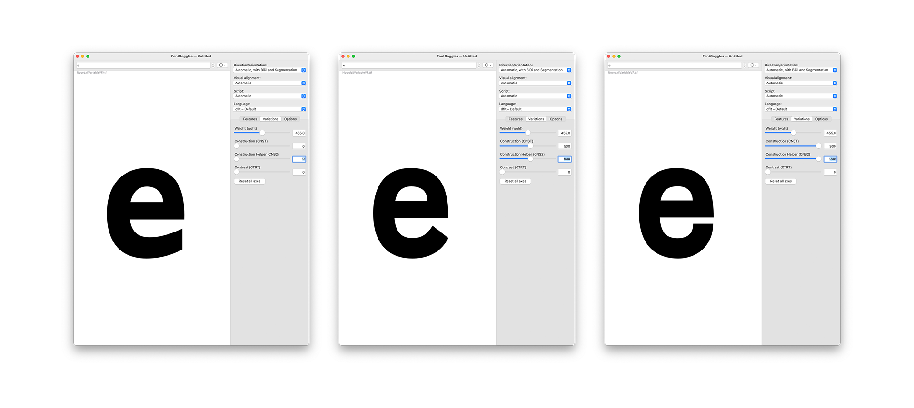

# Behind the cube

Much has been said about the Noordzij cube. Yet, often you only see its front and lefthand outermost layers. This representation can be quite difficult to wrap your head around, when you first encounter the Noordzij cube. So this is the endeavour to build it in 3D. To use it in the browser. As I mentioned, there are many folks around that will be able to tell you much more about this artifact than I can do. So this short test will take you into the making of this online cube and hopefully inspire you to play around with it — but not only the cube, but also the tools used to produce it.
I will take you into the workshop of mkaing this. From drawing the font to putting it online. So let’s get started:

## Drawing a font (+ deviation into higher order interpolation) 

Drawing the font was pretty straight forward. I examined some source Material — some Noordzij drawing, some covers of »The Stroke«, etc. — and drew the extremes. Yet, when interpolating these extremes, the tail of the e closes quite unpleasently. 

Enter: higher order interpolation or HOI in short. What this allows me to do: tame the tail of the e by defining not only its anchor points but also their movement. This also comes with a little tradeoff of having to introduce two new axes which help me to control the swning of the e’s tail. The glyphs files are available here for you to take a look, if you are interested in the concept.

If you want to learn more about the concept of higher order interpolation visit [Underware’s case study](https://underware.nl/case-studies/hoi/) or also Stephen Nixon’s [Higher Order Interpolation experiments](https://github.com/arrowtype/NLI-test).

## Setting up the cube in Blender (+ ST2)

Using variable fonts in 3D software can be tedious. Luckily, there’s a little Blender plugin which comes to our help [ST2 (formerly Coldtype)](https://github.com/coldtype/st2) by Rob Stenson. This Plugin made using the font in Blender smooth and easy. The cube was quickly constructed and all I had to do was to iterate through my axes and set every e to its position both in 3D space and in its design space — albeit here both are the same…
The Blender files can be found in this repository as well. Feel free to play around with them.

The last thing in this step was preparing the 3D file to work on the web. All I had to do was to export the cube as glTF to work in the browser.

## Preparing the web framework (+ Babylon JS)

Working with 3D files on the web has become increasingly less barrier burden in recent years. For the Noordzij cube I made use of of the [Babylon.js](https://github.com/BabylonJS/Babylon.js) framework to take care of the rendering of the 3D files. This process was pretty much plug and play: Take the 3D file and plug it into the framework to distribute it via the browser. 

Some UI to control both camera angles and the cube was added as well. This step seemed necessary to make full use of the cube: to rotate the e’s so that you could see them always facing you and see both the changes in weight and contrast. Toggling layers seemed to make sense as well to better orientate yourself in 3D space. But go and [have a look!](https://haw-type-design.github.io/noordzij-cube/)

## What’s next? (+ How you can play with this)

