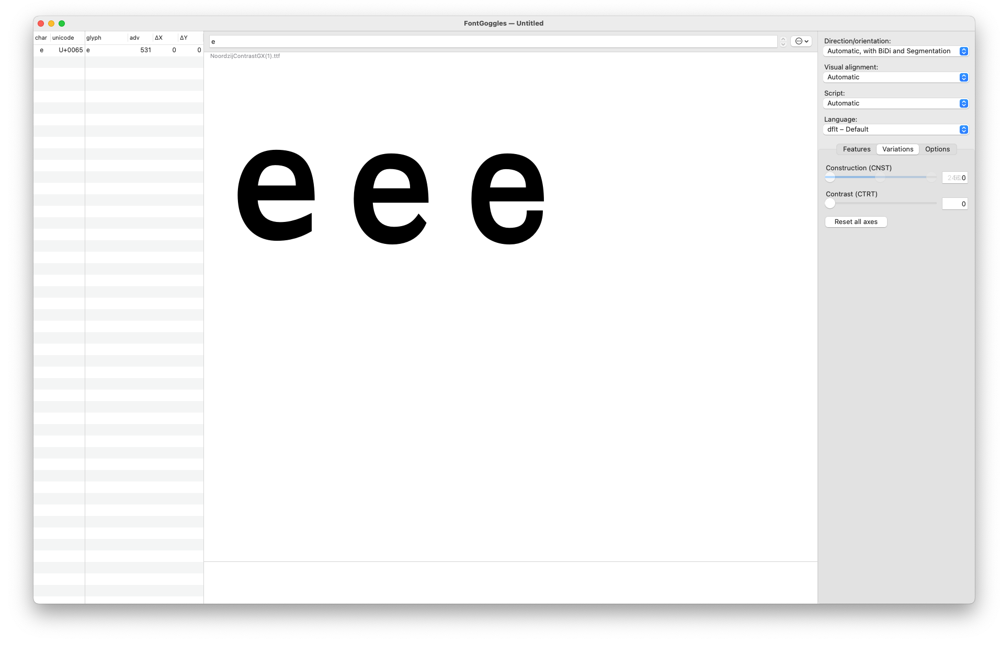

# Behind the cube

Much has been said about the Noordzij cube. Yet, often you only see its front and lefthand outermost layers. This representation can be quite difficult to wrap your head around, when you first encounter the Noordzij cube. So this is the endeavour to build it in 3D. To use it in the browser. As I mentioned, there are many folks around that will be able to tell you much more about this artifact than I can do. So this short test will take you into the making of this online cube and hopefully inspire you to play around with it — but not only the cube, but also the tools used to produce it.
I will take you into the workshop of mkaing this. From drawing the font to putting it online. So let’s get started:

## Drawing a font (+ deviation into higher order interpolation)

Drawing the font was pretty straight forward. I examined some source Material — some Noordzij drawing, some covers of »The Stroke«, etc. — and drew the extremes. Yet, when interpolating these extremes, the tail of the e closes quite unpleasently. 

## Setting up the cube in Blender (+ ST2)

## Preparing the web framework (+ Babylon JS)

## What’s next? (+ How you can play with this)

